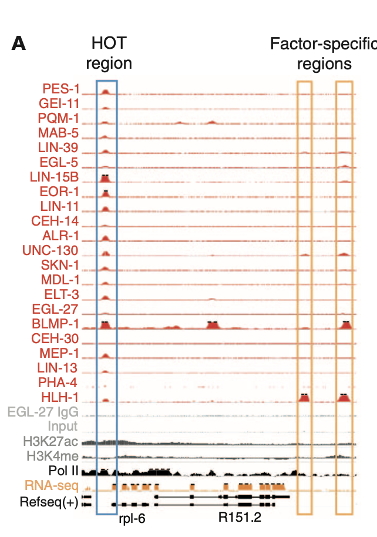
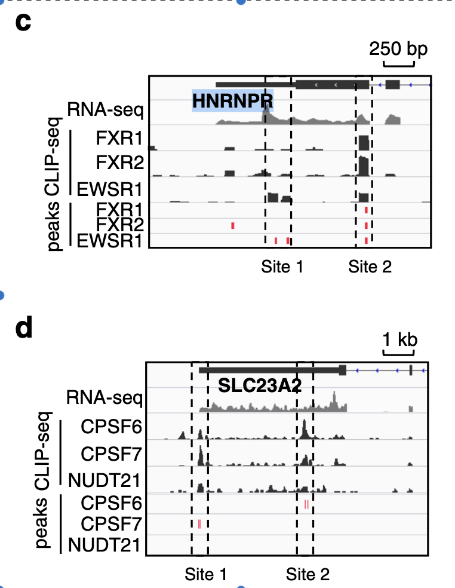
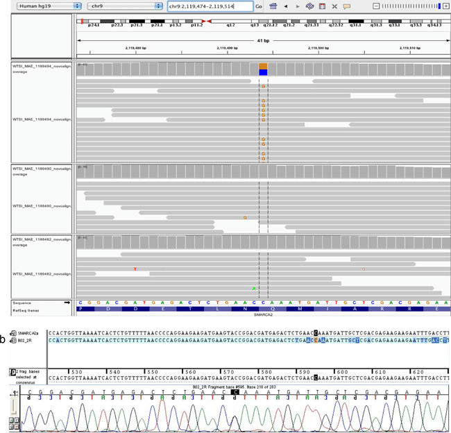

# 1.1 Genome Browser

在生物信息学中，基因组浏览器是用于显示来自生物学数据库的基因组数据的信息的图形界面。基因组浏览器使研究人员能够使用注释数据对整个基因组进行可视化和浏览，包括基因预测和结构，蛋白质，表达，调控，变异，比较分析等。注释数据通常来自多种不同的来源。

基因组浏览器是高通量测序分析的一个重要的可视化工具。相比于最终提供的表格，基因组浏览器可以提供更多的信息，如直观展示突变位点、查看有无新转录本或新的可变剪接形式、查看peak的可信度、上下游基因、区域保守性、重复元件、蛋白结合motif等。

基因组浏览器都可以按照位置或基因名字搜索，可进行局部放大和缩小。虽然每个软件略有不同，但基本操作是通用的。点一点，拽一拽，就都能用了。初次接触一个软件，多一点耐心，多一点操作，其实没那么难。


**特别注意：**

**在一个Genome Browser的视图中展示多套数据的多个track时，每个track的高度值（可定义max, min\)，一定要 "normalize to the number of total mapped reads in each track".**


## 0\) Examples

### Example 1\)  可视化RNA-seq, ChIP-seq等多套数据

### Example 2\)  可视化多套CLIP-seq及其定义的binding sites

### Example 3\)  可视化raw reads以及上面的SNV

## 1\) IGV genome browser app

* 从[IGV官网](http://software.broadinstitute.org/software/igv/download)下载APP;
* 演示视频  [@youtube](https://youtu.be/6_1ZcVw7ptU) [@bilibili](https://www.bilibili.com/video/av30448472/)

Integrative Genomics Viewer\(IGV\)是一个强大的基因组可视化工具，可以交互式的查看大多数的基因组相关数据，并且支持多种NGS测序数据类型。在大多数NGS数据分析中都会涉及到分析数据的可视化展示，IGV无疑为我们提供了一个便利的可视化途径。IGV提供了基于Java的本地版集成工具，也可以定制构建web版的IGV Browser，方便地存储并展示个人数据。

通过本教程，基本可以做到：

* 浏览不同的组学数据
* 快速探索定位基因组
* 对比对结果进行可视化
* 肉眼找找SNP/SNV以及结构变异

### 1.1\) 熟悉IGV

* 首先先在右上角选择**基因组版本**，默认情况下会加载hg19，当然可以自己下载其他基因组。然后点击顶部的`file` ，选择`load from server` ，这样就会选择**额外的几条track**，比如显示Ensembl基因名、GC含量等等，这一部分值得慢慢探索。

* 它的右侧默认显示`All` ，表示**全部染色体**。可以选择某一条特定染色体\(这里先选择Chr1\)
* 再向右的长框是**具体的区间**，输入`chr1:10,000-11,000` 表示从10000bp开始数显示1000bp长度的区间（注意是英文状态的冒号），然后点击`Go`。
* **侧边是track**（意为："轨道“、”跑道“），文件类型决定track的类型，track类型又决定了显示的方式，如峰图、线图、柱状图等。不同的track被加载进来时，它们是层层叠加的，可以利用左侧的track名称进行区分。

* 推荐的**文件类型**：[http://software.broadinstitute.org/software/igv/RecommendedFileFormats](http://software.broadinstitute.org/software/igv/RecommendedFileFormats)

> 其中规定比对的数据：SAM format \(**must be sorted**\), BAM format \(**must be sorted and indexed**\)

### 1.2\) 定位导航

**粗略定位**

输入`chr1:10,000-11,000` ，就将这1000bp的区间显示出来，还将序列显示为有颜色的长条，sequence顶部一行为碱基序列，其中A为绿色，C为蓝色，G是橙色，T是红色，这样利用颜色方便了识别重复序列；

另外它的下方几行是翻译的氨基酸序列，其中绿色表示蛋氨酸，红色为终止密码子，通过点击顶部那一行可以选择隐藏或显示氨基酸序列

**如何看的更精细？**

然后看右上角的`+` ，可以缩放，让我们看碱基看的更清楚，直到单碱基水平，它会先从基因开始显示，当放大到一定程度时，序列信息就展示出来\(看来自官网的解释：[https://software.broadinstitute.org/software/igv/sequence\_track\_options](https://software.broadinstitute.org/software/igv/sequence_track_options)\)

> 注意：sequence旁边的**黑色粗箭头**是可以点击的，点一下箭头方向会发生改变。箭头的方向表示当前展示的链，箭头向左为负链，会显示互补碱基信息以及反向互补的翻译信息

**另外除了根据位置去定位，还支持根据基因名去定位**

\(只要之前添加了基因名的注释track\)，例如直接在长条框中输入`BRCA1`

另外，定位到基因后，还可以看看两个相邻基因有什么区别：

比如可以看到：BRCA1和NBR2两个基因方向相反，BRCA1的第一个外显子在最右侧

**基因是用线和条形描绘的**

横线表示内含子区域，竖条表示外显子区域，箭头表示基因转录的方向或者说转录的链。高的竖条表示外显子的CDS区域，矮的竖条是UTR。图中表示的是3’=》5‘方向，基因也是在负链，5’UTR在左侧，3‘UTR在右侧

\(颜色不用管，都是自己可以设置的：右键track=》change track color\)

再看一个例子：

\(在biostar的解释：[https://www.biostars.org/p/105248/](https://www.biostars.org/p/105248/)\)

结合IGV理解这句话：

> **外显子与内含子的邻接部位**是一段高度保守的序列：外显子尾巴与下一个内含子的头部多数是GT，内含子的尾巴与下一个外显子的头部多数是AG，可以简单记做`GT-AG`法则，作为**RNA剪切的识别信号**

### 1.3\)  为检索区域添加书签

有时想保存当前的搜索区域，有点像浏览器的书签功能，可以利用`Regions` 的`Region Navigator`功能，当进行全局浏览时，可以边看边点击`add` 来添加

## 2\) UCSC genome browser on line

* [UCSC genome browser官方网页](https://genome.ucsc.edu/)
* **演示视频** [@youtube](https://youtu.be/eTgEtfI65hA) [@bilibili](https://www.bilibili.com/video/av30448417/)

> **Tips**：
>
> 1. 对于处理好的测序数据（bigWig, BAM, bigBed\)，UCSC仅支持通过提供URL链接或直接输入。
> 2. 在比较不同样本的数据时，需要根据样本本身测序深度的不同来对纵坐标进行调整,从而保证该区域/位点测序数据能够显示完整并且可以相互比较。
> 3. 有时，用 `bedtools genomecov -scale` 之后的 bigwig 文件纵坐标仍然会出现显示不完整等现象，此时需要手动调整下。

## 

